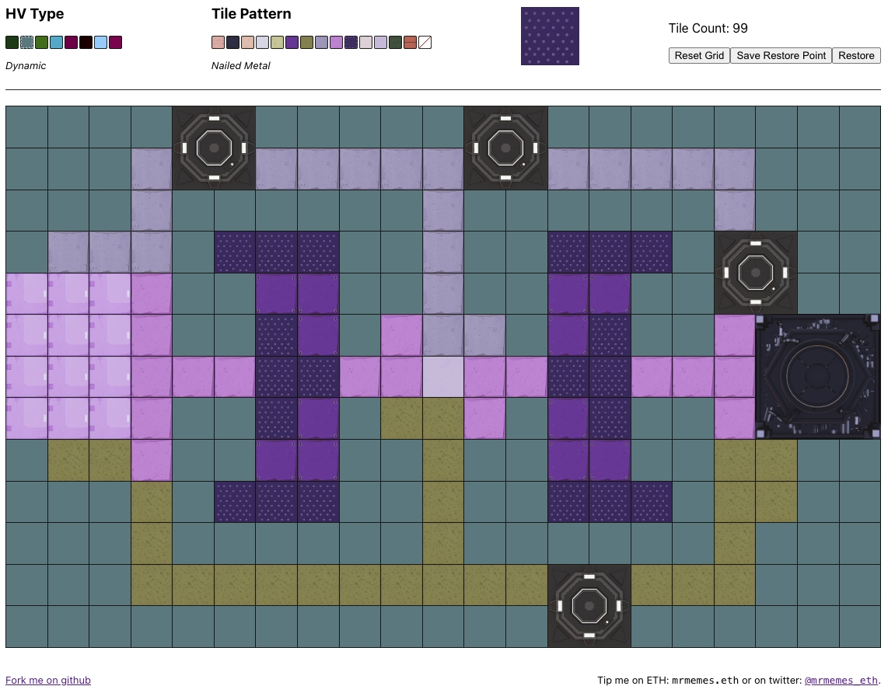

# hv-forge-sketcher

Simple tool for planning the layout of a Forge in the Yuga Labs HV-MTL game

### Tips

Saying thanks by tipping `mrmemes.eth` on ETH or
[`@mrmemes_eth`](https://twitter.com/mrmemes_eth) on twitter is very much
appreciated.  Linking transactions in feature requests gets my attention.

### Notes

* The non-optional tiles (base and portals) cannot have their tiles changed,
  since you can't do that in-game and have a fixed position on the grid.
* The grid is responsive and has a max-height set that prevents it from
  getting larger or wider than your screen
* Layouts are stored in local storage on your computer
* There is currently only support for one layout per HV type
* There are currently only 3 HV types (knight, bio and glitch) because those
  are the only kind I have
* There are currently only 14 tile patterns, as that's all I have unlocked
* Textures for tiles were extracted from the GLB files delivered over the wire
  in my play sessions. I took these 3D files and rendered them locally,
  capturing a top-down view instead of an isomorphic one.
* Improvements are very welcome

### Those weird little buttons

There are three control buttons that may help while you're iterating on your layout:

1. Reset Grid: clear all tile pattern placements and revert to the base grid
2. Save Restore Point: capture a "backup" for your layout... I use this to
   represent the current state of my grid and then iterate on potential
   changes.
3. Restore: replaces your current grid with the version stored by "save
   restore point"

### Running

The base app was generated with [Create React
App](https://create-react-app.dev/), so many [familiar
scripts](https://create-react-app.dev/docs/available-scripts) are available
for development. If you want to run locally or start development, you can:

1. `npm i`
2. `npm start`

&hellip;and your browser will be opened to `http://localhost:3000`.

### TODO

* Add support for remaining HV types
* Save, list and switch between named versions of grid layouts
* Display "correct" graphics for the base, portals and the "big portal"
* Add support for placing/rotating objects
* Undo/history
* mobile responsive